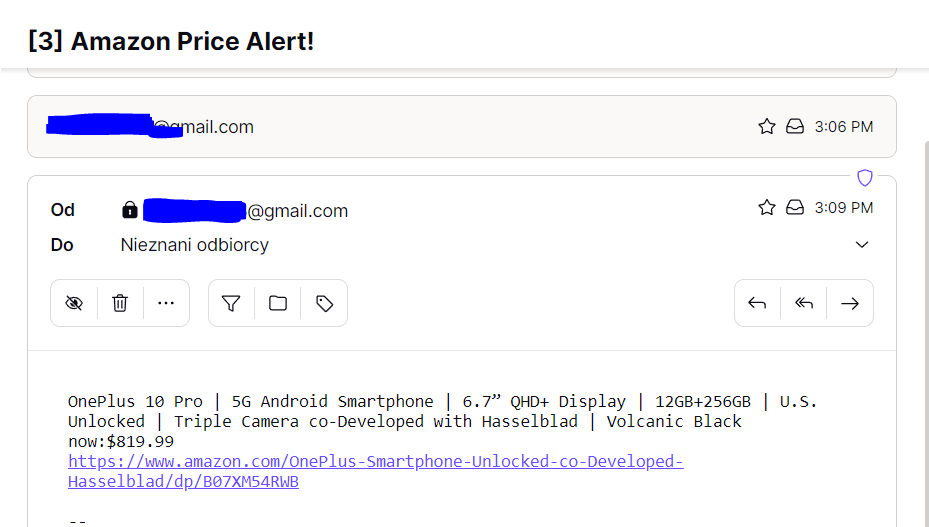

# Automated_Amazon_price_tracker

This program will works like a bot, that in first step scrapes the data from a given Amazon website product, and looks for the price and title of this product. In the next step this program can be set to check the price once per a day, with the use of https://www.pythonanywhere.com/ , and if the price drops below the target value set by the user, it will send an email notification, to make sure we don't miss this bargain!. 

---

Necessary steps to make the program work: 

1.  
Create a Gmail account that the program can use and generate an app_pssword for the account (https://help.prowly.com/how-to-create-use-gmail-app-passwords).

2.  
After creating the Gmail account, we have to change the name of .env.example to .env and define the environmental variables according to our account: 
MY_EMAIL = "EXAMPLE.USER@gmail.com" 
GMAIL_APP_PASSWORD = "GMAIL_APP_PASSWORD" 

3.  
The user has to adjust the starting variables in the main.py: 
*TARGET_PRICE* = 800.00 - target price needs to be adjusted, example 800.00  
*AMAZON_PRODUCT_TO_TRACK_URL* = "https://www.amazon.com/OnePlus-Smartphone-Unlocked-co-Developed-Hasselblad/dp/B07XM54RWB"  - the Amazon url of the product we want to track, example onplus 10 url  
*EMAIL_RECIVER* = "example@proton.me  - the email where the program will send the notification.   
*MY_HTTP_HEADER* = { } - define your header as dictionary, you can use http://myhttpheader.com/ to retrieve the data. This is needed to be able to read with request the Amazon url and to escape the captcha check.    

Hint:  
In order to find a good target price, we can use 
https://camelcamelcamel.com/  

---

Example of received email: 

---

**The program was developed using python 3.10.6, BeautifulSoup, requests, dotenv, smtplib**

In order to run the program, you have to execute main.py.

