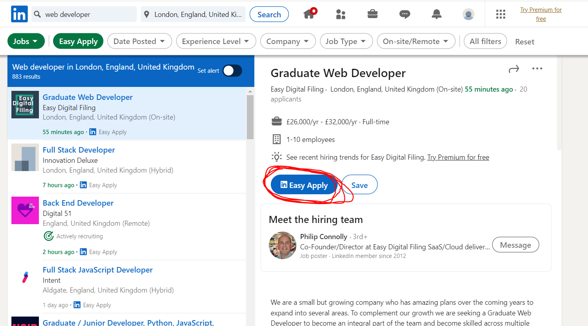
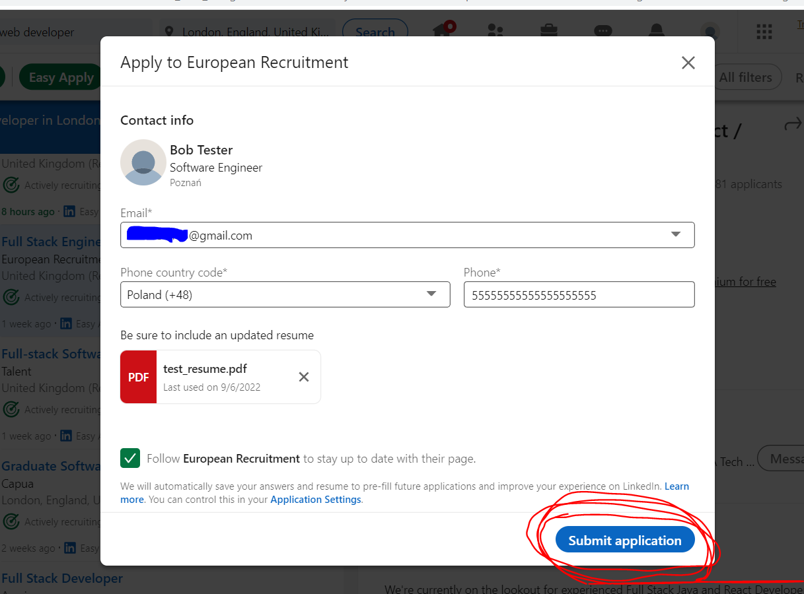
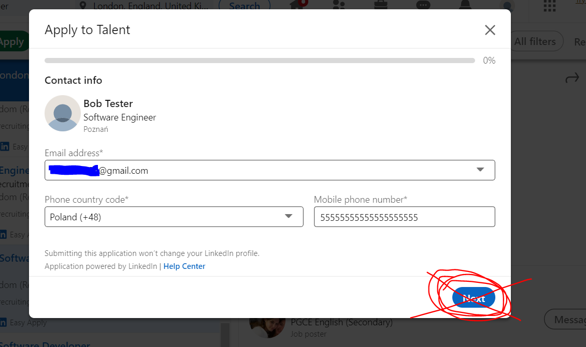

# Automating_job_applications_on_linkedin

This is an automated job application bot. The program will use selenium WebDriver 
to automate applying for jobs on LinkedIn with the "Easy Apply" function to send applications to all the jobs that meet your criteria (instead of just a single listing).
In the first step, it will log in to your LinkedIn account, and then go to the specific search job URL defined in the program by the user. 
After accessing this URL, the bot will go through each of the application and asses if there is a function of Easy Apply.
If it doesn't exist, the job application will be skipped, and the bot will move to the next job application.
After finding the Easy Apply button, the bot will submit the first step of application by pressing it.
In the next step, the bot will validate how the application form looks. 
If the application form will have the button next which indicates a multistep application, the bot will terminate the application,
only application with "submit application" will be accepted. 
The bot will submit the application, and fill in the given phone number and send out the application.
After that, the bot will move to the next job application.  

Necessary steps to make the program work: 
1. Install Chrome browser https://www.google.com/intl/en_uk/chrome/  
2. Download chrome driver (don't forget to match the version of your chrome with the version of the chrome driver) https://chromedriver.storage.googleapis.com/index.html?path=104.0.5112.79/, and unzip the file for your OS.
Mark the DIR to the chromedriver.exe file and adjust the *chrome_driver_path* in main.py.  
3. Sign up to LinkedIn  https://www.linkedin.com/ and configure your Profile.  
Make sure you've signed up to LinkedIn and save your email and password somewhere for later use. 
Upload your resume by going to Me -> Settings & Privacy -> Data Privacy -> Job Seeking Preferences -> Job Application Settings. 
NOTE: Do not enable 2-factor authentication/phone number verification while we are using Selenium. 
4. After creating the LinkedIn account, we have to change the name of .env.example to .env and define the environmental variables according to our account: 
MY_LINKEDIN_EMAIL = "YOUR.EMAIL@gmail.com" 
MY_LINKEDIN_PASSWORD = "Your_password" 
5. The user has to adjust the starting variables in the main.py: 
*PHONE_NUMBER* - phone number to be filled in the form during application. 
*WEBSITE_URL_FOR_THE_DRIVER* - URL for job search. 

---

**Example of view Easy Apply application:** 

 

**Example of view of submitting application:** 

 

**Example of view of invalid form with a next button - multistep application is not supported:** 

 

---

**The program was developed using python 3.10.6, selenium**

In order to run the program, you have to execute main.py.
