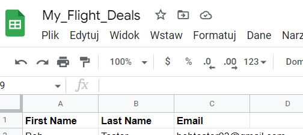
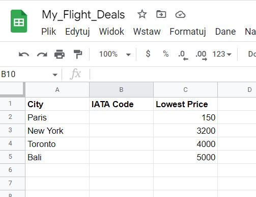
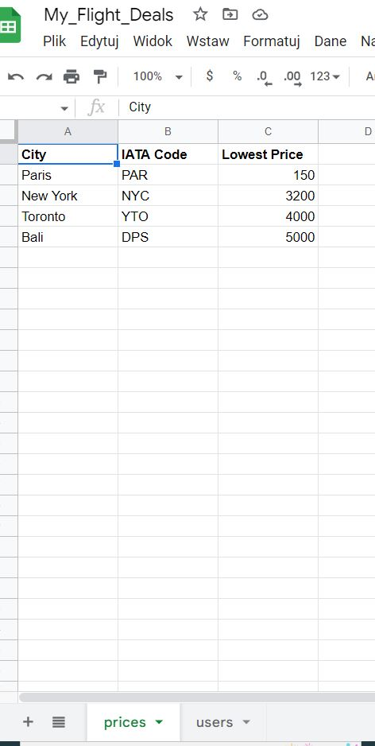
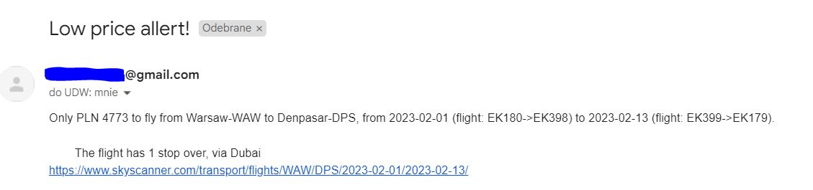
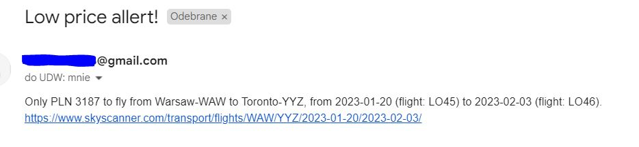

# Cheap_flight_finder

This program will find cheap flight deals and notify the user via email about the best prices. The user has to define a Google spreadsheet, which the program will use to keep track of the locations that we want to monitor and a price cutoff (a historical low price) which will be used as a threshold for defining a deal. As well as spreadsheet with all the users that will be notified if there is a low deal hit.  

The data from the spreadsheets will be accessed via an API - Google Sheet Data Management - https://sheety.co/ .
Next, the retrieve data will be feed into a flight search API - https://partners.kiwi.com/ , 
and in the first step, the IATA codes will be autocompleted. After all fields are filled in our spreadsheet, the program will 
feed this data into a flight search API that will run every day, searching through all the locations. Looking for the cheapest flight. 
When it comes up with a hit, and it finds a flight that's actually cheaper than our predefined price, then it's going to send that data and price via an email to all the users defined in our spreadsheet.  

Necessary steps to make the program work:

1.  
Create a Google Excel spreadsheet for the users that looks exactly like this (values in rows can be adjusted): 

And then you have to use a standalone program main_add_user.py to populate the spreadsheet of users.
You can run this program in a cloud service like https://replit.com/ and give access to different users who would have an option
to add their emails to the list.

For this standalone program, you will have to register and obtain your own data
from the API https://sheety.co/ and define the environmental variables:
API_SHEETY_END_POINT_USERS = "YOUR_OWN_SHEETY_END_POINT"
API_SHEETY_BASIC_PASSWORD = "Bearer YOUR_OWN_PASSWORD"
AS well as link your spreadsheet to your project and create an endpoint. Look point 5.

2.  
Create a Google Excel spreadsheet for the prices that looks exactly like this (values in rows can be adjusted): 

 

3.  
We need to create a Gmail account that the program can use and generate an app_pssword for our account (https://help.prowly.com/how-to-create-use-gmail-app-passwords).

4.  
Create an account in the flight search API https://partners.kiwi.com/ and obtain an API key.
It is also necessary to create a solution for the project to enable search options. 
Kiwi Partner's Flight Search API (Free Signup, doesn't Require Credit Card Details) - 
Tequila Flight Search API Documentation - https://tequila.kiwi.com/portal/docs/tequila_api

5.  
While logged in your Gmail account, you should log into the API https://sheety.co/ 
and create a new project and link it to your spreadsheet that you created above (point 1,2).
And also obtain your own sheety end point for the project as well as the password for the authorization.
Thousands of people are using Sheety to turn their spreadsheets into powerful APIs to rapidly develop prototypes, websites, apps and more. 

6.  
After obtaining the data, we have to change the name of .env.example to .env and define the variables according to our data: 
MY_GMAIL_EMAIL = "EXAMPLE.USER@gmail.com" 
GMAIL_APP_PASSWORD = "GMAIL_APP_PASSWORD" 
API_SHEETY_END_POINT_PRICES = "YOUR_OWN_SHEETY_END_POINT_FOR_PRICES" 
API_SHEETY_BASIC_PASSWORD = "Bearer YOUR_OWN_PASSWORD" 
API_TEQUILA_KEY = "YOU_OWN_TEQUILA_API_KEY" 
API_SHEETY_END_POINT_USERS = "YOUR_OWN_SHEETY_END_POINT_FOR_USERS" 

7.  
The user has to adjust the starting variables in the main.py:
ORIGIN_CITY_IATA = "WAW" # city of departure  

8.  
After we run the main.py for the first time, the IATA Codes will be autopopulated in our spreadsheet prices,
which should result in a view like below: 

 

Example of received emails:

The program was developed using python 3.10.05, requests, smtplib, APIs. 

In order to run the program, you have to execute the main.py to start the low prices deals search and
main_add_user.py for adding users.