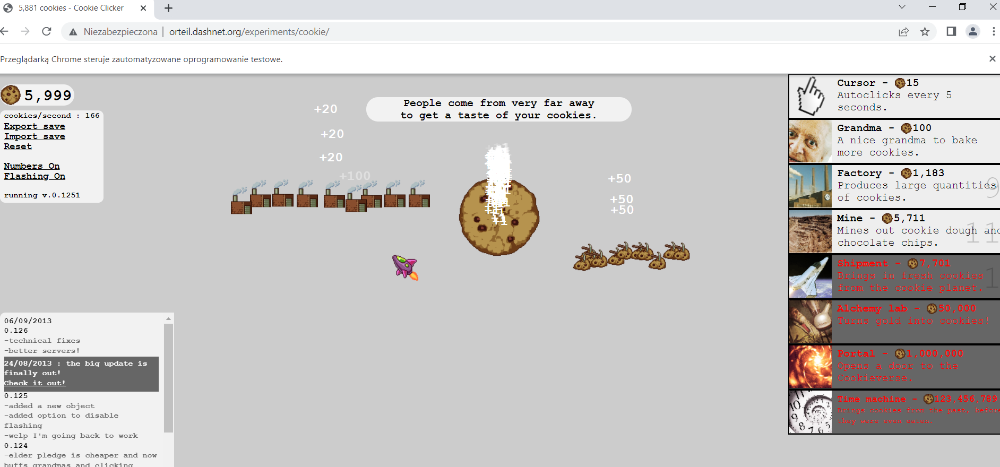
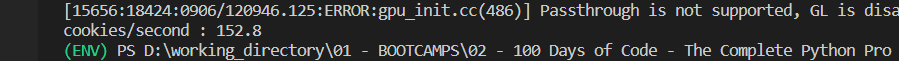

# Cookie_Game_playing_bot

This is a gaming bot created with selenium to play the game Cookie Clicker, http://orteil.dashnet.org/experiments/cookie/.
It will click the cookie and decide which upgrades / add-ons to buy (if we have money) in order to maximize the rate of clicked cookies and to get a higher score. 
The game bot will try to maximize the cookies per second rate because the more add-ons you buy the higher the rate gets.

Necessary steps to make the program work: 

1. Install Chrome browser https://www.google.com/intl/en_uk/chrome/  
2. Download chrome driver (don't forget to match the version of your chrome with the version of the chrome driver) https://chromedriver.storage.googleapis.com/index.html?path=104.0.5112.79/, and unzip the file for your OS.
Mark the DIR to the chromedriver.exe file and adjust the *chrome_driver_path* in main.py.  
3. Set the starting settings in the main.py to your liking.  
TIMEOUT_GAME - how long should the game run  
TIME_FOR_UPGRADE - time in seconds to check for new upgrades  

---

Example of view of the game after starting: 

Ending score will be displayed in the console as cookies per second: 

---

**The program was developed using python 3.10.6, selenium**

In order to run the program, you have to execute main.py.