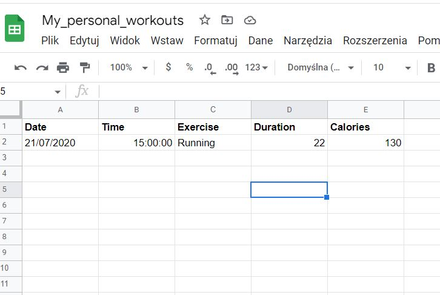

# Exercise_Tracking_app

This app tracks the exercises that we are doing, and how long we are doing them for, and also figures out how many calories did we burn because of the workout that we did. The data is stored online to a Google spreadsheet where it can be easily accessed and viewed.  
1. First, the user is asked about the exercises that will be logged in an Excel spreadsheet. This is done with an English sentence. 
Example input: running 10km and cycling 55min 
 
2. Next the program will use the API https://www.nutritionix.com/business/api which uses natural processing to decode our sentence and
get the information it requires.  
3. In the last step, the program will use the API https://sheety.co/ and create a new row and update the desired Google spreadsheet. 
Example view after updating the row:  

The user will end up with a Google spreadsheet that is easy to view online. This way, the user can keep track of the exercises.  

In order for the program to work, we need to prepare: 

First: 
create a Google Excel spreadsheet that looks exactly like this: 

 

Secondly: 
While logged in your Gmail account, you should log into the API https://sheety.co/ 
and create a new project and link it to your spreadsheet that you created above.
And also obtain your own sheety end point for the project as well as the secret token for the authorization.
Thousands of people are using Sheety to turn their spreadsheets into powerful APIs to rapidly develop prototypes, websites, apps and more. 

Thirdly: 
Register and obtain the free API key and API id from https://www.nutritionix.com/business/api. 

Fourthly: 
After obtaining the data, we have to change the name of .env.example to .env and define the variables according to our data: 
NUTRITIONIX_API_KEY = "YOUR_OWN_API_KEY" 
NUTRITIONIX_API_ID = "YOUR_OWN_API_ID" 
API_SHEETY_END_POINT = "YOUR_OWN_SHEETY_END_POINT" 
API_SHEETY_SECRET_TOKEN = "Bearer YOUR_OWN_TOKEN" 

Lastly: 
The user can adjust the personal variables in the main.py:  
GENDER = "male"  
WEIGHT_KG = "70.5"  
HEIGHT_CM = "176"  
AGE = "33"  
They are used by the API https://www.nutritionix.com/business/api. 

The program was developed using python 3.10.05, requests, APIs. 

In order to run the program, you have to execute the main.py.