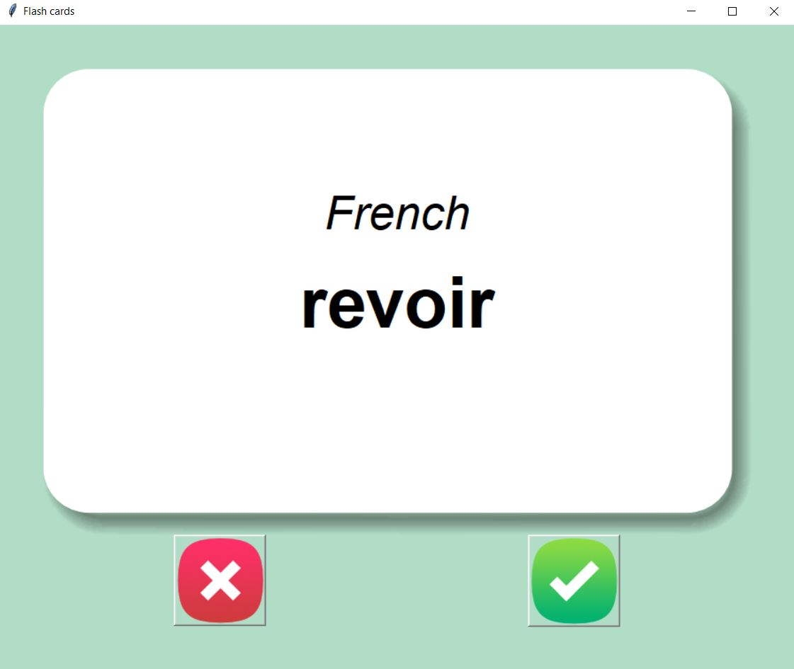
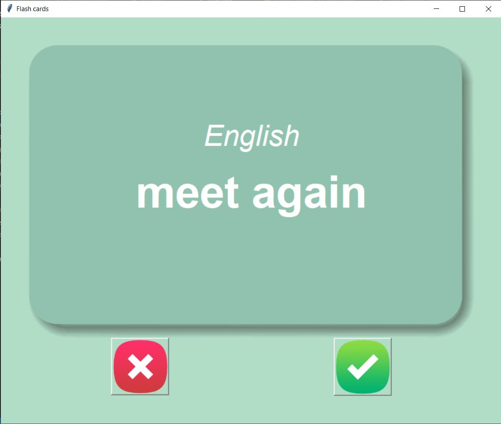

# Flash_card_program

The flash card program is used to help you study foreign languages. You can learn the most frequently used words in any language. It will show the user the front and back of each flash card. So, for example, one side will show you the desired language to learn with a word from this language, and after three seconds, the program will flip the card and show the same word in English on the other side, and the user has to make a choice whether the foreign word was known or not. If the user knew the meaning of the word, then the green check button should be pressed, and if the user was not familiar with it, the red cross button should be pressed. So whenever the user confirms that the word is known, the program will take out this word from the list of flash cards to learn and keep showing only the flashcards that were chosen as unknown (red cross button pressed, or the card is shown for the very first time).

The foreign words are stored in the directory .\data\ as CSV files.

french_words.csv - default file with all the French / English words.

french_words_to_learn.csv - this file will include only the words that aren't mastered by the user. The program will always try to read first from this file and if it doesn't exists it will read from the default file. It will be updated every time the user hits the green check button.   

The program was developed using python 3.10.05, Pandas and Tkinter for GUI. 

In order to run the program, you have to execute the main.py.

Example view: 

