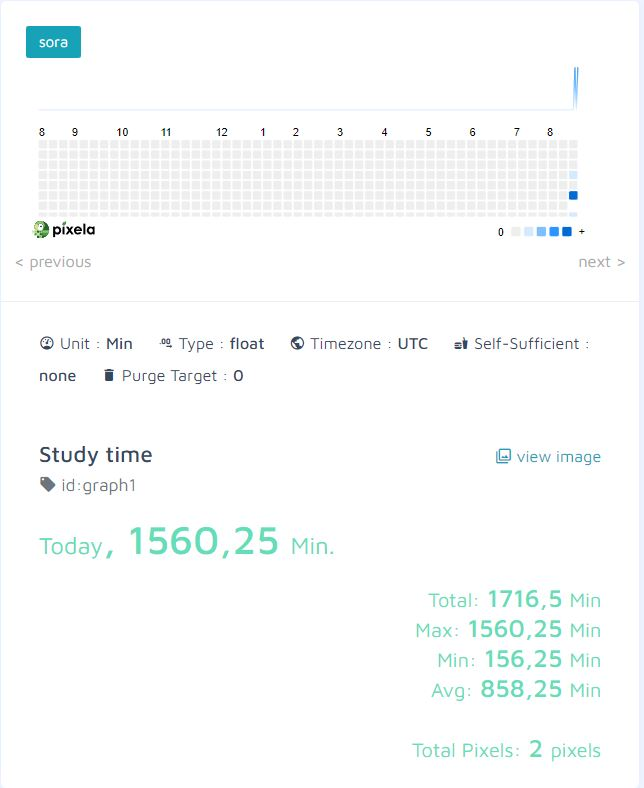

# Habit_tracker

This program uses an API called https://pixe.la/ (https://docs.pixe.la/)
and tracks the habits and intensity of a given activity. It shows how to use the API and its basic HTTP requests, like:  
GET - requests.get() - retrieving data  
POST - requests.post() - create data  
PUT - requests.put() - updating data  
DELETE - requests.delete() - deleting data  

Pixela is the API service. With this service, you can get a GitHub like graph that expresses the degree of your daily various activities on a basis with a vivid gradation. All operations are performed by API. And, it's free.

https://github.com/a-know/Pixela

The program was developed using python 3.10.05, requests, API. 

In order to run the program, you have to execute the main.py.

Example view: 

