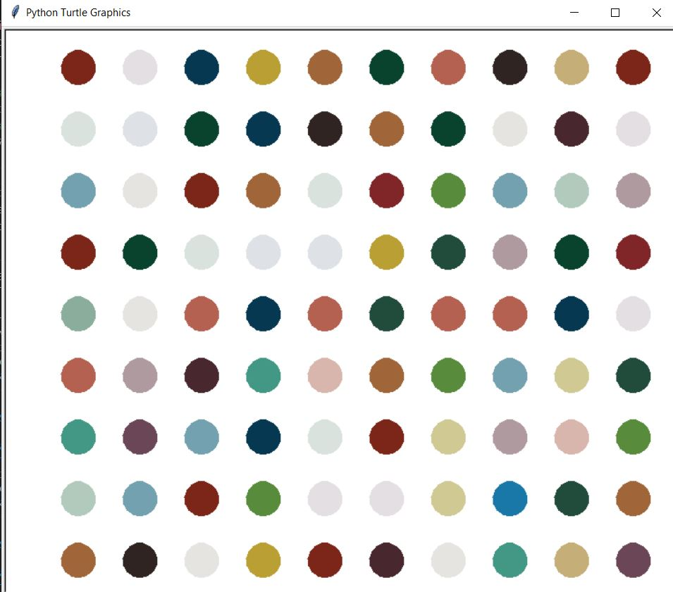

# Hirst_painting

It is a project where we try to recreate some art of the famous Damien Hirst random spot paintings. First, using python library colorgram for defining color palette from a painting (color_palette.jpg). 
Next, we use the library Turtel and the extracted colors to draw a random spot painting.  

Drawing constrains:
10 by 10 dots, with each size 20 and spacing 50 (Turtle sizing)

https://en.wikipedia.org/wiki/Damien_Hirst

To run the program, execute main.py.
Every time you run the program, a new random picture will be generated. 

Example output:
 

