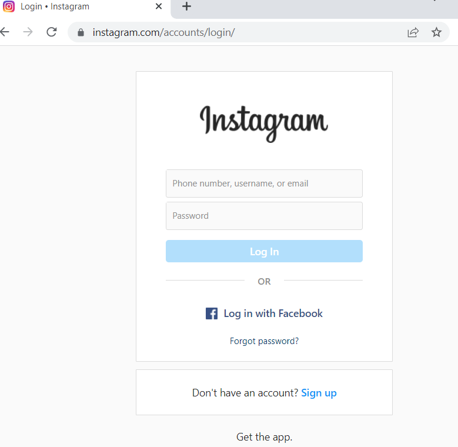
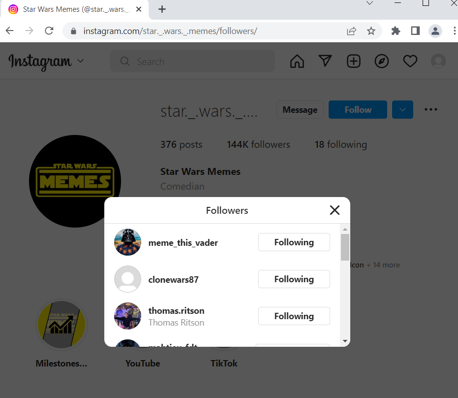
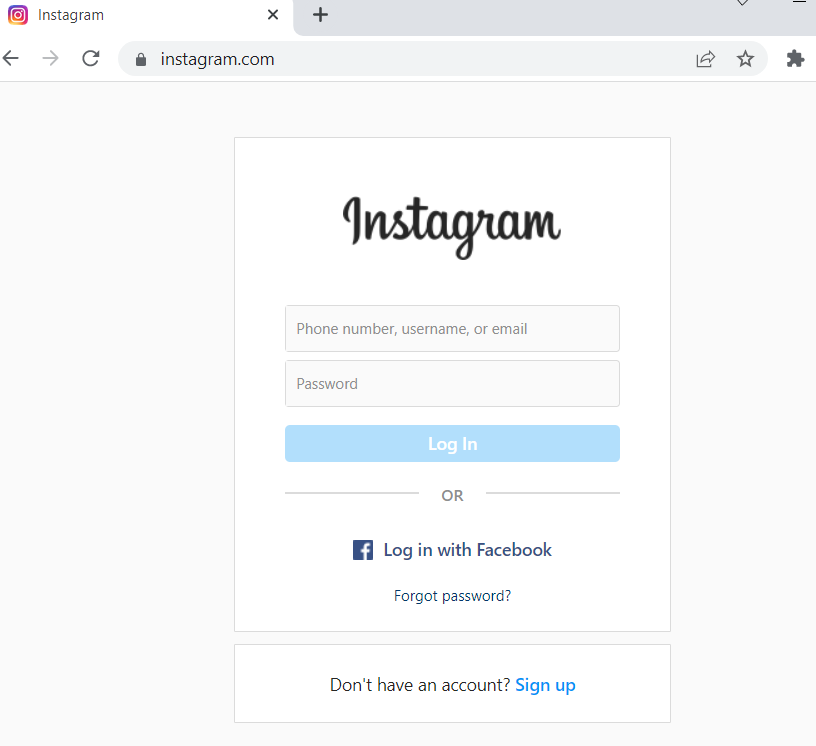

# Instagram_follower_bot

It is a python selenium based bot that will boost your followers by following simple steps.
First, it will automatically log in to your Instagram account. Secondly, it is going to go to the account you want to replicate followers for and check its followers. In the last step, the bot will follow these individual accounts one by one automatically.
This way, the accounts you followed might notice your account and follow you back. 
So basically, follow the followers of your competitors in your given market should boost your own follower count (given that your content is of similar nature). 

---

Necessary steps to make the program work: 
1. Install the Chrome web browser https://www.google.com/intl/en_uk/chrome/  
2. Download Chrome Driver (don't forget to match the version of your Chrome with the version of the Chrome Driver) https://chromedriver.storage.googleapis.com/index.html?path=104.0.5112.79/, and unzip the file for your OS.
Mark the DIR to the chromedriver.exe file and adjust the *CHROME_DRIVER_PATH* in main.py.  
3. You will need an Instagram  account. Sign up for Instagram, https://www.instagram.com/.  
4. After creating the Instagram  account, we have to change the name of .env.example to .env and define the environmental variables according to the created account: 
*MY_INSTAGRAM_EMAIL* = "your.email.for_Instagram@no-replay.com" 
*MY_INSTAGRAM_PASSWORD* = "Your_Instagram_password" 
5. The user has to adjust the starting variables in the main.py: 
*SIMILAR_INSTAGRAM_ACCOUNT* - account you want to replicate followers for. Figure out which account you would like to target. (Pick a large account that has a lot of followers). This user has to exist in Instagram otherwise the bot will terminate the porgram with an Error: Maybe the user doesn't exist! 
*CHROME_DRIVER_PATH* - as stated in point 2. 
6. Install the required libraries from the requirements.txt using the following command:  
*pip install -r requirements.txt* 

---

**The bot automatically logs in.** 
 

**The bot automatically opens the given user Instagram and starts following the given user followers.** 
 

**The bot will log out at when done with adding followers.** 
 

---

**The program was developed using python 3.10.6, selenium**

In order to run the program, you have to execute main.py.