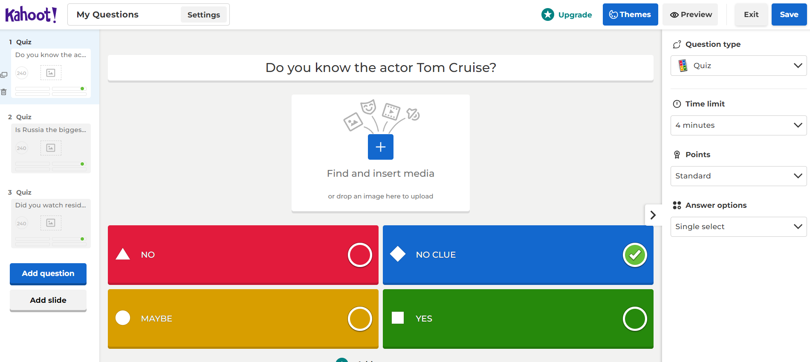

# Kahoot_automated_quiz_creating_bot

This is a bot built with the Python library Selenium that will generate quizzes and answers on the Kahoot platform automatically
https://kahoot.com/. In the first step, the programme will read the file questions.txt (each line has a new question).
Next, the programme will navigate to and open a Chrome web browser with the address https://create.kahoot.it/creator,
where the bot will automatically log the user in and, based on the questions in the txt file, generate
a quiz. Some data for the quiz can be adjusted, like the title of the quiz, the description of the quiz, the time to answer each of the questions in the quiz, and the questions in the txt file. At the end, the bot will save the quiz and exit the browser.
To use the program, the user must first create a free account at Kahoot! (https://kahoot.com/) and fill out the data in the file .env (MY_EMAIL = "YOUR_EMAIL_FOR_KAHOOT@proton.me", MY_EMAIL_PASSWORD = "YOUR_PASSWORD_FOR_KAHOOT")
After you have created a quiz, you can share it with friends and have them play it. You can view the quiz results in your Kahoot account later. 

---

The necessary steps to make the program work: 
1. Install the Chrome web browser https://www.google.com/intl/en_uk/chrome/  
2. Download Chrome Driver (don't forget to match the version of your Chrome with the version of the Chrome Driver) https://chromedriver.chromium.org/downloads, and unzip the file for your OS.
Mark the DIR to the chromedriver.exe file and adjust the *CHROME_DRIVER_PATH* in main.py.  
3. Create a free account on https://kahoot.com/ . 
4. Change the name of .env.example to .env and define the environmental variable (MY_EMAIL = "YOUR_EMAIL_FOR_KAHOOT@proton.me", MY_EMAIL_PASSWORD = "YOUR_PASSWORD_FOR_KAHOOT") that you used in step 3. 
5. Install the required libraries from the requirements.txt using the following command:  
*pip install -r requirements.txt* 

---

**An example view:** 

 

 

---

**The program was developed using python 3.11.0, selenium**

In order to run the program, you have to execute main.py.