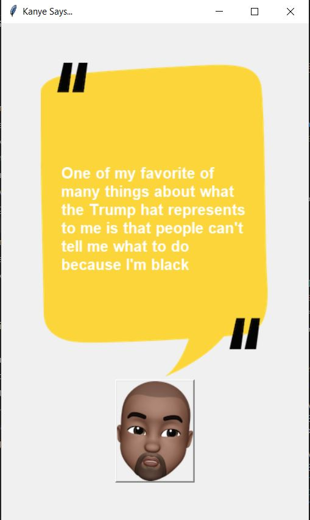

# Kanye_quotes

Every time we press the button with the emoji of Kanye West, we will get a new quote fetched from the https://kanye.rest/ API and display it on the GUI main screen. 

The program was developed using python 3.10.05 and requests.

In order to run the program, you have to execute the main.py.

Example view: 

