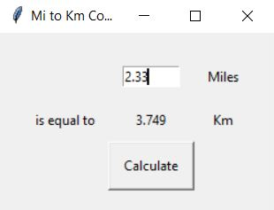

# Miles_Kilometers_converter_GUI

This is a unit converter program using Tkinter. This program has a graphical interface and is used to convert miles to kilometers or can be easily adjusted to convert liters to gallons (or whatever little conversion that you might often use).
A fully-fledge Python graphical user interface program.

Example input: 2.33 miles

Example output: 3.749 kilometers

The program was developed using python 3.10.05 and Tkinter. 

In order to run the program, you have to execute the main.py.

Example view: 

