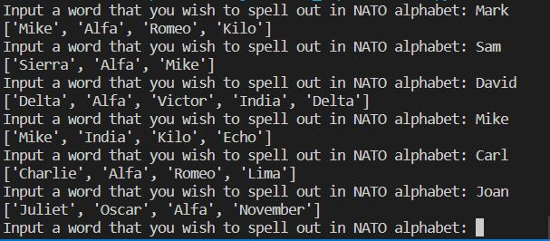

# NATO_phonetic_alphabet_converter

This program converts the given word to the NATO phonetic alphabet. The NATO phonetic alphabet is read from a file 'nato_phonetic_alphabet.csv' using Pandas library. The user has to type down a word in the console, and it returns a list of phonetic alphabet that matches each of the letters in the given word. 

Example input: Mark
Example output: ['Mike', 'Alfa', 'Romeo', 'Kilo']

The program was developed using python 3.10.05 and Pandas. 

In order to run the program, you have to execute the main.py.
In order to terminate the program, type the command 'Exit'

Example view: 

