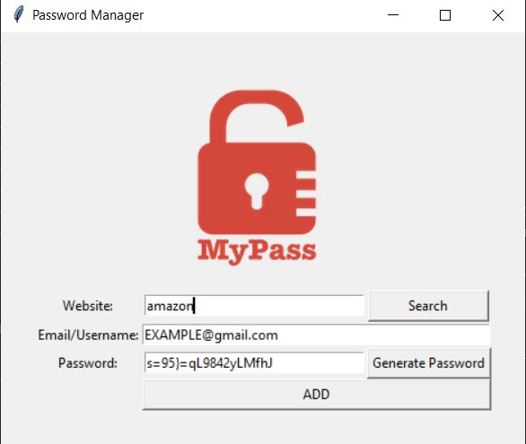

# Password_manager

This program is used to store and generate passwords. It requires filling few fields, like:

Website - this is used only as description for future identification. So it is easier to deduct what this password is for.

Email/Username - which is prepopulated but can be change to any username / email address.

Password - here we fill in the password we want to store, or we can choose to autogenerate a password with the Generate Password button, which results also in copying the newly generated password into our clipboard and be ready to use it right away. 

After completing the form, we can add the password to our list of passwords, which will be saved in a data.txt file. Hitting the Add button will result in another pop up window asking for confirmation of adding a new password to the list. 

The program was developed using python 3.10.05 and Tkinter for GUI. 

In order to run the program, you have to execute the main.py.

Example view: 

