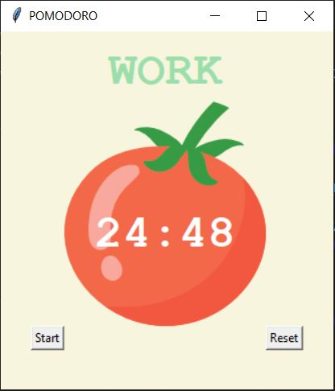
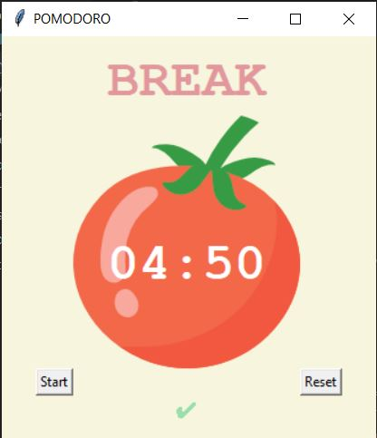

# Pomodoro_app

This is a famous technique that helps people time-manage and to get more stuff done.
If you're figuring out a time-consuming task, then you can set your timer to 25 minutes and then work on the task for 25 mins and after that you take a short five-minute break. After doing four of these sequence repetitions called pomodoros, you take a longer break between 15-30 mins. This way you can break your work into intervals, which arguably helps with information retention and also with keeping the motivation. This program will help you keep track of time according to the famous pomodoro technique. It is a timer with a tomato on it, and when you click start, it is going to tell you to work for 25 minutes. Then that window can go into background and while you are working on your task, when the timer's up it will pop to the very front of the screen above all the other windows and tell you to take a break. So the first break is for 5 mins, and you will notice the program will mark which pomodoro cycle was completed. Once you're done with the break, it's going to go back to work, and it's going to continue until you reach the longer break or until you click to stop or reset the timer. This program will help you to do these Pomodoro where you have 25 minute work, 5 mins break. You do four of these 25 mins sessions, and you get a 20-minute break.

https://en.wikipedia.org/wiki/Pomodoro_Technique

The program was developed using python 3.10.05 and Tkinter for GUI. 

In order to run the program, you have to execute the main.py.

Example view: 

