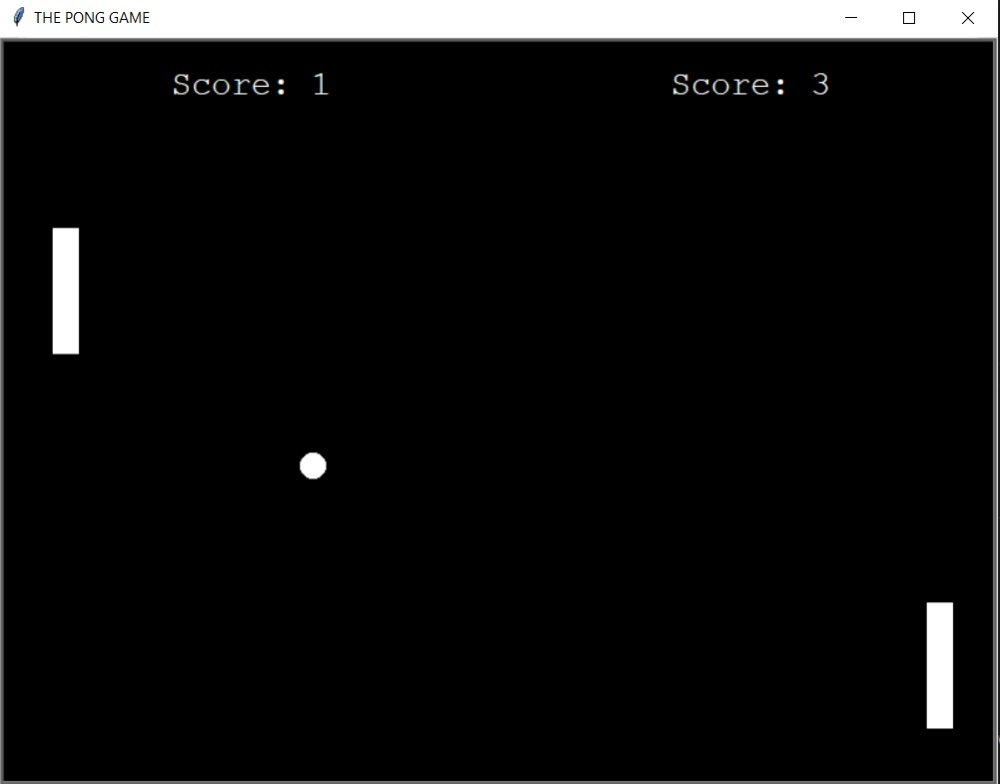

# Pong_arcade_game
 
The Pong game it is a classic arcade game and probably one of the first one. It has a really simple premise. It's basically just a ball that is going across a table and two players each control a paddle bouncing the ball back and forth. If you miss the ball, then the other player scores a point. The right player controls the right paddle with the arrow keyboards: 'UP' and 'DOWN', and the left player controls left paddle with the keyboard 'W' and 'S'. In order to increase the difficulty of the game, each time the ball bounces from one of the paddles, it will increase its speed. 

The game was developed using the library Turtle and python 3.10.05. According to the OOP methodology. 

In order to run the game, you have to execute the main.py.

https://en.wikipedia.org/wiki/Pong

Example view: 

