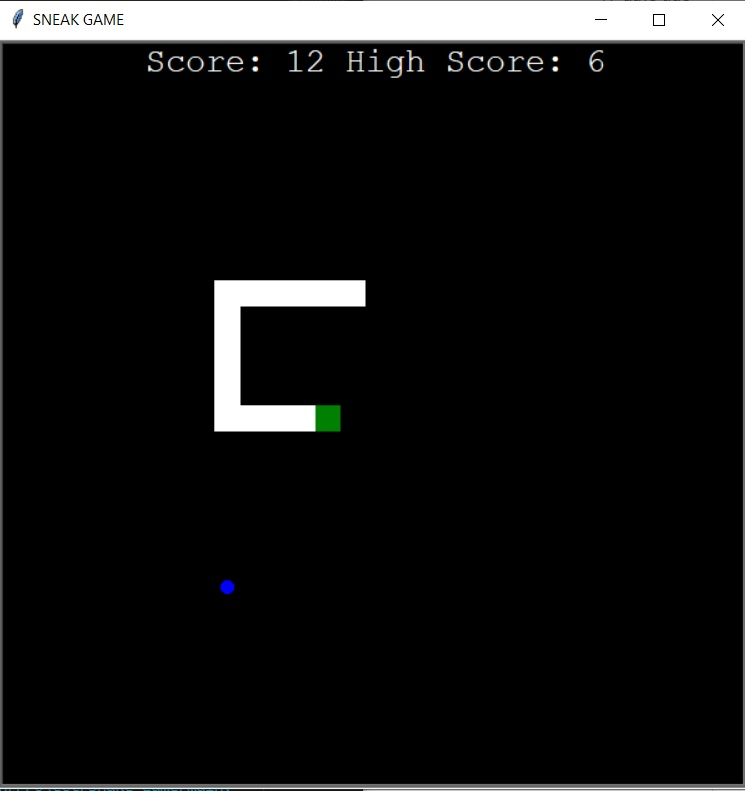

# Snake_game
 
Snake game has, a moving snake, which you control using your arrow keyboards (UP, RIGHT, DOWN, LEFT). The aim is to collect food objects that appear randomly on the screen. It will grow in length as it eats more food. You have to make sure that you don't end up getting tangled or hitting the wall, which would result in Game Over. 
The goal is to eat as much food as you can while staying alive.
You'll be able to see your score on the scoreboard located on the top of your screen, as well as the high score that will be stored in a file and loaded at the beginning of each game.

The game was developed using the library Turtle and python 3.10.05. According to the OOP methodology. 

In order to run the game, you have to execute the main.py.

https://en.wikipedia.org/wiki/Snake_(video_game_genre)

Example view: 

