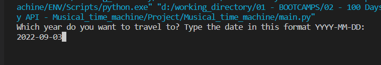
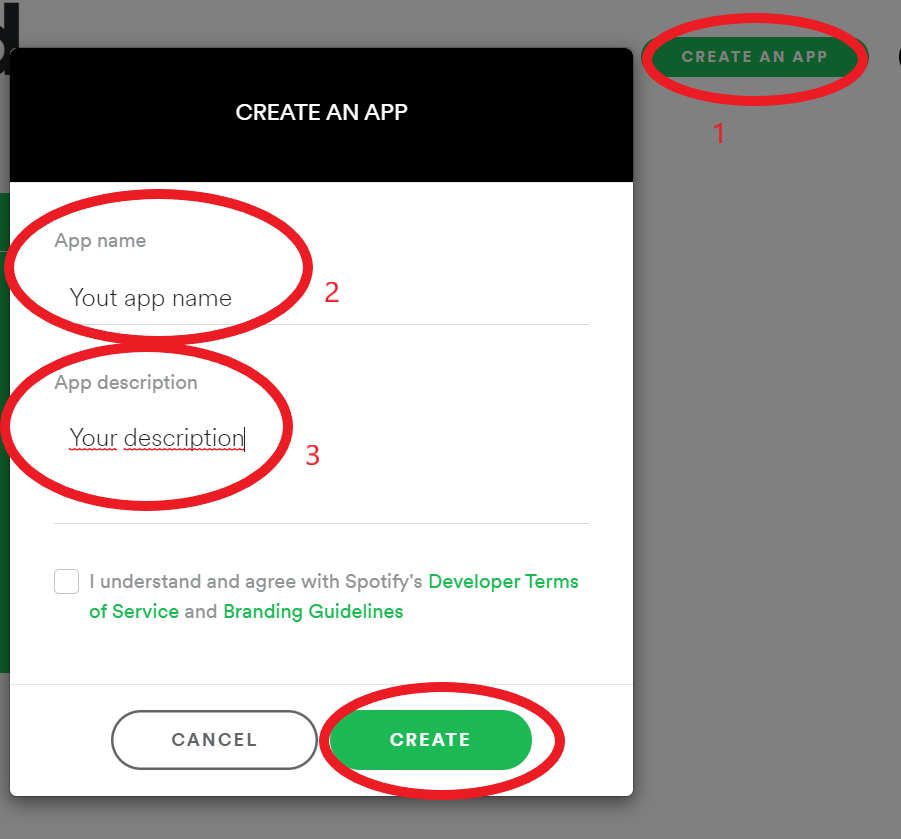
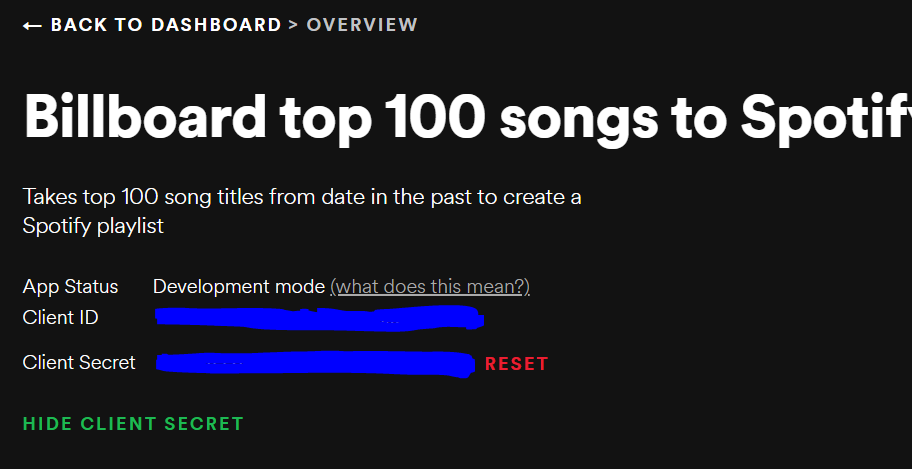
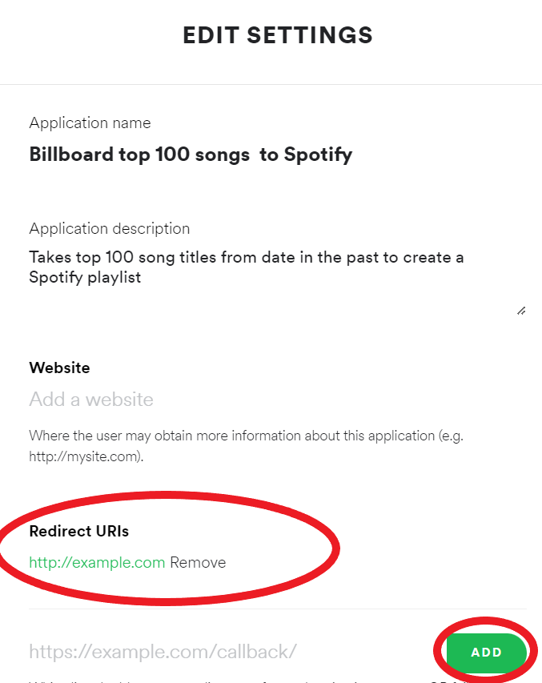
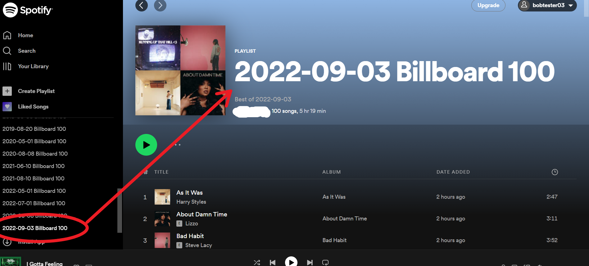

# Spotify_playlist_generator

This program validates the given date by the user with regular expression operations and later uses Python's BeautifulSoup library for scraping data from a music website ( https://www.billboard.com/charts/hot-100/ ) for that date, in order to find a list of top 100 songs. Based on the scraped data, it will automatically create a Spotify playlist using the spotipy library (Spotify API).

---

The program will be executed in the following steps: 
1. Awaiting user input: a date input in the format YYYY-MM-DD (like 2020-12-20), which will be validated using regular expression operations. 

 
2. The date from step 1 will be used to scrape the data from the website https://www.billboard.com/charts/hot-100/  . 
3. The song titles will be retrieved from step 2 and converted into a list. 
4. A Spotify token will be created to authenticate your Python project with Spotify (user authorization with OAuth). 
5. The authorized user will use the app to retrieve URIs from sportify for each of the song titles from step 3. 
6. A Spotify playlist will be created and populated with the songs from step 5. 

---

*Main libraries used in this porgram:*  

**BeautifulSoup** 
https://www.crummy.com/software/BeautifulSoup/bs4/doc/ 

**re — Regular expression operations** 
https://docs.python.org/3/library/re.html 

**requests** 
https://requests.readthedocs.io/en/latest/ 

**spotipy** 
https://spotipy.readthedocs.io/en/master/ 

---

In order to run the program: 
1. Create a free Spotify account.
https://open.spotify.com/  , and login to your account. 
2. Login to the developer-Spotify https://developer.spotify.com/dashboard/ ,
and create an app, giving it a name and description (https://developer.spotify.com/documentation/general/guides/authorization/app-settings/). 
 
3. Obtain your SPOTIPY_CLIENT_ID and SPOTIPY_CLIENT_SECRET and set the SPOTIPY_REDIRECT_URI (https://spotipy.readthedocs.io/en/master/) 
 
 
4. Change the name of .env.example to .env and define the variables according to your data: 
SPOTIPY_CLIENT_ID="your-spotify-client-id"  
SPOTIPY_CLIENT_SECRET="your-spotify-client-secret"  
SPOTIPY_REDIRECT_URI='your-app-redirect-url'  
5. Run the file main.py and enter the date in the correct format. 
 
6. The end result should be the creation of a playlist in your account with the given date. 
 

---

**The program was developed using python 3.10.6, BeautifulSoup, requests, dotenv, re,  spotipy,  Spotify API.**

In order to run the program, you have to execute main.py.