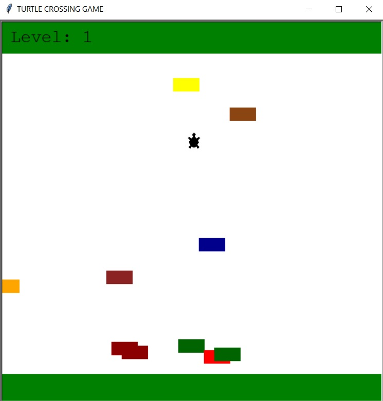

# Turtle_crossing_game
 
In the Turtle crossing game, we have a bunch of cars spawning randomly on the right side of the screen and going across a super busy multilane highway. The player controls the turtle on the bottom side of the road with arrow keyboard 'Up', which can only go forwards. The aim is to cross the road without being hit by the cars driving on it.
Once the player reaches the other side of the screen, the cars speed up (next level), but the player goes back to the starting position, ready to cross the screen again. 
At any point when a car hits the player turtle, the game ends with a Game Over.

Rules:
1. A turtle moves forwards when you press the 'Up' key. It can only move forwards, not back, left or right.
2. Cars are randomly generated along the y-axis and will move from the right edge of the screen to the left edge.
3. When the turtle hits the top edge of the screen, it moves back to the original position and the player level up. On the next level, the car speed increases.
4. When the turtle collides with a car, it's game over and everything stops.

The game was developed using the library Turtle and python 3.10.05. According to the OOP methodology. 

In order to run the game, you have to execute the main.py.

Example view: 

