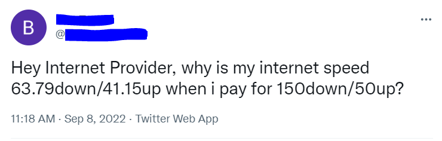

# Twitter_complaint_Bot

This is a complaining Twitter bot that will first test your internet speed using https://www.speedtest.net/, and if the speed is lower than the user-specified speed, it will automatically log in to your Twitter account and send a tweet with the relevant information to your internet provider. The tweet will include information like the internet upload and download speeds to indicate how much they are below the minimum that was promised. This boat was developed using the PYTHON Selenium library. 

---

Necessary steps to make the program work: 
1. Install the Chrome web browser https://www.google.com/intl/en_uk/chrome/  
2. Download Chrome Driver (don't forget to match the version of your Chrome with the version of the Chrome Driver) https://chromedriver.storage.googleapis.com/index.html?path=104.0.5112.79/, and unzip the file for your OS.
Mark the DIR to the chromedriver.exe file and adjust the *chrome_driver_path* in main.py.  
3. You will need a Twitter account. Sign up for Twitter  https://twitter.com/i/flow/signup .  
4. After creating the Twitter account, we have to change the name of .env.example to .env and define the environmental variables according to the created account: 
*MY_TWITTER_EMAIL* = "your.email.fortwitter@no-replay.com" 
*MY_TWITTER_USERNAME* = "you_twitter_username" 
*MY_TWITTER_PASSWORD* = "Your_twitter_password" 
5. The user has to adjust the starting variables in the main.py: 
*PROMISSED_DOWNLOAD_SPEED* - the promissed download speed from the internet provider in Mbps. 
*PROMISSED_UPLOAD_SPEED* - the promissed upload speed from the internet provider in Mbps. 
*chrome_driver_path* - as stated in point 2. 

---

**An example of a test result for internet speed** 
 

**An example of a tweet** 
 

---

**The program was developed using python 3.10.6, selenium.**

In order to run the program, you have to execute main.py.
