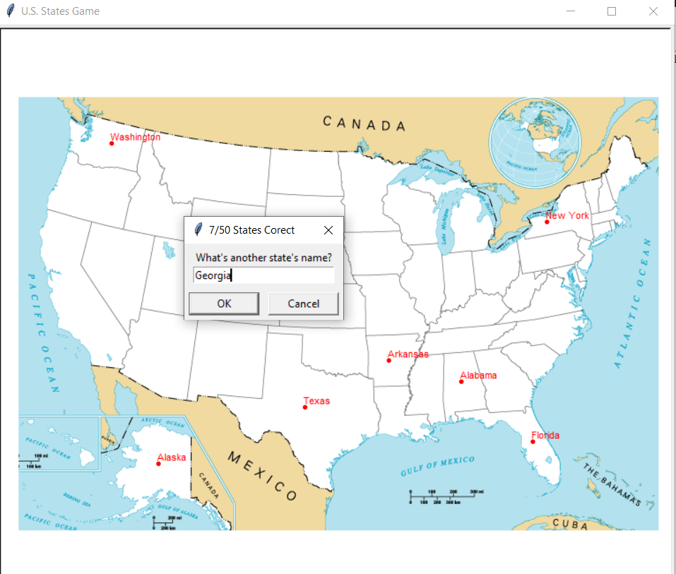

# US_States_map_quiz
 
This game tests you on your knowledge of the names of the 50 states in the USA. Every time we guess the correct state name, it will appear on the map at the location of the state. The aim of the game is to remember all the names of the states and to name as many as you can. This is an interactive and educational game. At any time, the user can write in the box "Exit" instead of a state name, and the game will terminate, and output all the missed states to a new file 'states_to_learn.csv'.

All the states and positions are referenced with the data in the file '50_states.csv'. 
The program was developed using python 3.10.05, Pandas, Turtle. According to the OOP methodology. 

In order to run the program, you have to execute the main.py.
Typing 'Exit' and submitting it with OK will terminate the program. 

Example view: 

