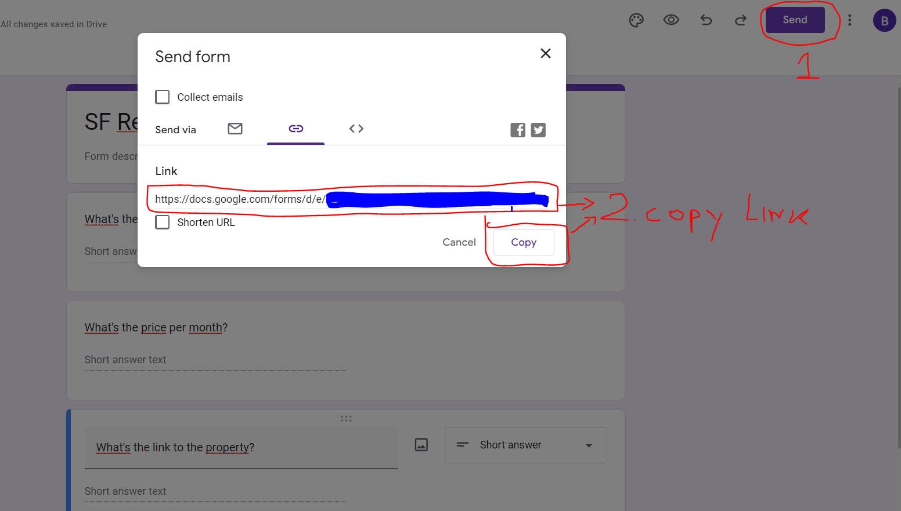

# Zillow_rental_research_scraper

This is a program that tackles a research data entry job where the aim is to
find house prices that fit a particular client's criteria. The house prices will be scrapped
using python's library Beautifulsoup from the Zillow website https://www.zillow.com/.
The address, price for rent, and link with the offer will be stored in a dictionary.
The program will then use Python's Selenium library to transfer that data into a Google form https://docs.google.com/forms/ (Auto filling the forms). After the process is done, the user can download or view the data in a Google spreadsheet. BeautifulSoup + Selenium. 

---

What is the aim of the program: 
1. We are going to go to Zillow, which is one of the largest real estate listing sites in the US, and we are going to search to see if we can find a place to rent in San Francisco. 
2. Clients' criteria (output should be a list with all the places that meet the criteria): 
- San Francisco, CA (area) 
- up to 3000 USD per month (max price) 
- at least 1 bedroom (at least one bedroom) 

---

The necessary steps to make the program work: 
1. Install the Chrome web browser https://www.google.com/intl/en_uk/chrome/  
2. Download Chrome Driver (don't forget to match the version of your Chrome with the version of the Chrome Driver) https://chromedriver.chromium.org/downloads, and unzip the file for your OS.
Mark the DIR to the chromedriver.exe file and adjust the *CHROME_DRIVER_PATH* in main.py.  
3.  Set up a Gmail account, https://accounts.google.com/.   
4. Make your own Google Form: Sign in to your Gmail account, then go to https://docs.google.com/forms/ and create a form:   
- Step 1 - create a blank form: 
 

 
 

- Step 2 - fill in the three questions as short answers as below: 
 

 
 

- Step 3 - copy the link to the form: 
 

 
 

5. The user has to adjust the starting variables in main.py: 
*CHROME_DRIVER_PATH* - as stated in point 2. 
6. The user has to adjust the starting variables in form_bot.py: 
*URL_TO_MY_FORM* - as stated in point 4 - step 3. 
7. The user has to adjust the starting variables in the web_scrapper.py: 
*MY_HTTP_HEADER* - go to http://myhttpheader.com/ to check your own header values and update them accordingly. 
*WEBSITE_URL_ZILLOW_PREDEFINED_SEARCH* - It is already pre-populated with an example URL. It is possible to adjust the search criteria by visiting the website https://www.zillow.com/ and selecting the criteria that we want, like location, max price, for rent or sale, in order to get a list of elements. After we are done, we have to copy the url which will include the searching criteria and define our variable as this url. 
 
An example view of a given search criteria for Zillow: 
 

 

8. Install the required libraries from the requirements.txt using the following command:  
*pip install -r requirements.txt* 

---

**Creating a Google Spread Sheet after the forms are submitted.** 
Under the tab Responses, there is a button to view the response in sheets.. 
 

 

**An example view of the spreadsheet after the process is done.** 
 

---

**The program was developed using python 3.10.6, selenium, BeautifulSoup, requests**

In order to run the program, you have to execute main.py.